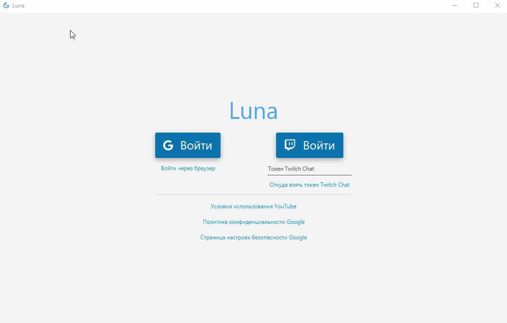

# Luna

Приложение создано для стримов на YouTube и Twitch.

Оно позволяет считывать команды от пользователей в чате стрима и реагировать на них (В данный момент главная команда - это проигрывание музыки). К примеру:

* /hello - посылает в чат ответ "Привет"
* /track <ссылка на музыку из YouTube/название музыки> - позволяет проигрывать музыку на стороне стримера. Стример может пропустить музыку нажав на кнопку "пропустить трек" или на кнопку F12 из любого приложение, если стример включил данную возможность. Во время проигрывания музыки мьютится Google Chrome на компьютере.

     Музыка поддерживает очередь песен, настройку максимального времени трека.
     
     Музыка поддерживает стриминг музыки сразу в дискорд бота (удобно при игре с друзьями). Его необходимо создать самостоятельно - [перейти на сайт разработчика discord](https://discord.com/developers/applications) - Создать новое приложение - Bot - Создать нового бота - Скопировать его токен и вставить его в специальное поле в приложении (он сохранится). Для приглашение вашего бота на свой сервер необходимо сгенерировать URL - [перейти на сайт разработчика discord](https://discord.com/developers/applications) - Oauth2.0 - Выбрать в scopes "bot" - Выбрать "Bot permissions" View Channels, speak, connect, send messages. read messages history - Скопировать сгенерирвоанную ссылку в ваш бразуер и присоеденить бота к вашему каналу.
     
     Если вы не планируете стримить музыку через дискорд, то создавать дискорд бота не обязательно. Просто выберите пункт "Локальная музыка".
     
[Скачать последнюю версию](https://github.com/Makunika/Luna_app/releases/latest)

## Установка

Скачайте Luna.rar, разархивируйте в любую папку и запускайте:

* Luna.exe - обычный запуск, то есть консоль приложения будет скрываться
* Luna-debug.exe - консоль приложения не будет скрываться

После устанановки приложение будет автообновляться до последней версии.
